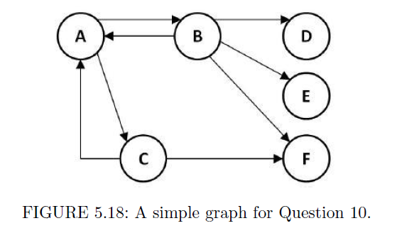

```{r setup, include=FALSE}
knitr::opts_chunk$set(echo = TRUE)
library(knitr)
library(igraph)
library(tidyverse)
```

# 2. An Introduction to Graph Theory

**1.** Count the number of the following in Figure 2.9:

{width=50%}

(a) Vertices: 13
(b) Edges: 17
(c) Multiple edges: 5
(d) Loops: 2
(e) Vertices adjacent to vertex $a$: 3
(f) Vertices connected to vertex $a$: 8


**2.** Draw the subgraph induced by the following in Figure 2.9:

(a) Induced by te vertices $\{a,b,c,d,e\}$.

```{r, fig.height = 4, fig.width = 4, fig.align = 'center'}
plot(graph(c("a","b","a","c","a","d","b","e","c","c"), directed = FALSE))
```

(b) Induced by the edges $\{x,y,z\}$.

```{r, fig.height = 4, fig.width = 4, fig.align = 'center'}
plot(graph(c("g","j","g","k","j","l"), directed = FALSE))
```


**3.** In Figure 2.10, are graphs $Y$ and $Z$ isomorphic? If so, give an isomorphism. Are they automorphic? If so, given an automorphism.

{width=50%}

Graphs $Y$ and $Z$ are isomorphic. Isomorphism:

|$V(Y)$|$V(Z)$|
:-----:|:-----:
|$a$|$a$|
|$b$|$e$|
|$c$|$c$|
|$d$|$d$|
|$e$|$b$|
|$f$|$f$|

Graphs $Y$ and $Z$ are not automorphic.


**4.** A planar graph is a graph that can be drawn on a plane (such as a sheet of paper) so that none of its edges cross. Attempt to draw the following, and conjecture which of these tasks are possible and which are impossible:

(a) Draw a planar clique of size 4: Possible.
(b) Draw a planar clique of size 5: Impossible.
(c) Draw a planar clique of size 6: Impossible.


**5.** Draw an undirected tree and then attempt to do the following tasks. Conjecture which of these tasks are possible and which are impossible:

```{r, fig.height = 4, fig.width = 4, fig.align = 'center'}
plot(make_tree(8, children = 3, mode = "undirected"))
```

(a) Draw a directed tree with the same number of vertices and edges: Possible.
(b) Draw a new undirected tree with the same number of vertices but a different number of edges: Impossible.
(c) Add an edge to the tree without creating a cycle: Impossible.
(d) Remove an edge from the tree without disconnecting any pair of vertices: Impossible.


# 5. Link Analysis

**1.** Why do you think PageRank was conceptualized? What would have happened had we just considered the number of backlinks to a page to rank a page high or low?

PageRank was conceptualized in order not to be hacked. So it is important to consider the backlinks of a page and the quality of those pages (Are these pages linking to many other pages? Are they being linked by other quality pages?). If you only consider the number of backlinks of a page, you can create lots of fake pages to link a page and overestimate it.


**2.** Let the adjacency matrix for a graph of four vertices ($n1$ to $n4$) be as follows:

$$A= \begin{bmatrix} 0 & 1 & 1 & 1 \\ 0 & 0 & 1 & 1 \\ 1 & 0 & 0 & 1 \\ 0 & 0 & 0 & 1 \end{bmatrix}$$

Calculate the authority and hub scores for this graph using the HITS algorithm with $k = 6$, and identify the best authority and hub nodes.

```{r}
A <- matrix(c(0,1,1,1,
              0,0,1,1,
              1,0,0,1,
              0,0,0,1),
            byrow = TRUE,
            nrow = 4)
k <- 6
X <- matrix(c(1,1,1,1))
Y <- matrix(c(1,1,1,1))
for (i in 1:k) {
  X <- t(A) %*% Y
  Y <- A %*% X
  X <- X / sqrt(sum(X^2))
  Y <- Y / sqrt(sum(Y^2))
}
```

The best authority node is $n_{`r which(X == max(X))`}$ and the best hub node is $n_{`r which(Y == max(Y))`}$.


**3.** Now that you know how the PageRank function in R works, try to find the effect of changing the value of the damping factor in the example in Section 5.4.5 to the value 0.65 and note the changes.

```{r}
g <- random.graph.game(20, 5/20, directed = TRUE)
kable(data.frame(damping_85 = round(page.rank(g)$vector, 4),
                 damping_65 = round(page.rank(g, damping = 0.65)$vector, 4)),
      align = c("c","c"))
```

There are no significant differences between damping factors $d = 0.85$ and $d = 0.65$, but it seems to be more differences at the extreme values.


**4.** Can you give any two advantages/disadvantages of the PageRank algorithm?

* It is hard to manipulate it because it uses the importance of the other pages.
* The output is only one vector, so the conclusions are not flexible.


**5.** What is the complexity of the PageRank algorithm? Can you make an argument about why that is the complexity of this algorithm?

The PageRank score of a page is calculated using a recursive method to compute an eigen vector, because it is impossible to calcule it if we have too many pages, so we need lots of iterations to converge to the actual matrix. That means a lot of computation.


**6.** Is there a possibility that a website's PageRank would increase? What about the chances of it decreasing?

A website's PageRank will increase if other websites that links it increase its PageRank's value, or if these other websites decrease its number of links. In the reverse situation, the website's PageRank will decrease.


**7.** Given the HITS scoring vector

$$X= \begin{bmatrix} 3.12 \\ 4.38 \\ 6.93 \\ 3.41 \\ 1.88 \\ 4.53 \end{bmatrix}$$

Normalize $X$ for the next iteration of the algorithm.

```{r}
A <- matrix(c(3.12,4.38,6.93,3.41,1.88,4.53))
A / sqrt(sum(A^2))
```


**8.** After reading Section 5.3 answer the following:

(a) Define the density of a graph.

The density of a graph is the number of existing edges divided by the number of possible ones (assuming no duplicates or loops).

(b) What does a `TRUE` for `is.isolate(graph,5)` indicate?

It means that the node 5 is isolated in the graph.

(c) Given a graph variable `graph` what is the difference between `is.connected(graph)` and `connectedness(graph)` in R?

The function `is.connected(graph)` checks if the graph is strictly connected or not. Meanwhile, the function `connectedness(graph)` returns the Krackhardt's connectedness value of the graph.

(d) Define the degree of a vertex in a graph.

The degree of a vertex is the number of edges incident on it.


**9.** (a) Explain the differences between the hub and authority scores in the HITS algorithm.

Hub scores takes into account how many pages are pointing the node, meanwhile the authority score consider the number of pages are pointing to the node.

(b) How could someone use the definitions to exploit the HITS algorithm?

The HITS algorithm can be used for different applications, depending on the score analyzed.

(c) Is it reasonable to use static (i.e., unchanging) data over the $k$ iterations of HITS? Justify your answer.

No, if we use static data the algorithm will never converge. The point to do the iterations is to converge the actual scores.


**10.** Consider the graph (Figure 5.18) with 6 pages ($A$,$B$,$C$,$D$,$E$ and $F$) where:

$A \rightarrow B,C$

$B \rightarrow A,D,E,F$

$C \rightarrow A,F$

{width=50%}

Assume that the PageRank values for any page $m$ at iteration 0 is $PR(m) = 1$ and that the damping factor for iterations is $d = 0.85$. Perform the PageRank algorithm and determine the rank for every page at iteration 2.

By the summation method:

```{r}
A <- matrix(c(0,1,1,0,0,0,
              1,0,0,1,1,1,
              1,0,0,0,0,1,
              0,0,0,0,0,0,
              0,0,0,0,0,0,
              0,0,0,0,0,0),
            byrow = TRUE,
            nrow = 6)
d <- 0.85
k <- 2
update_PR_m <- function(m,A,PR,d) {
  x <- 0
  for (i in seq(nrow(A))) {
    if (A[i,m] == 1 & i != m) {
      x = x + (PR[i] / sum(A[i,]))
    }
  }
  return((1 - d) + d * x)
}
PR_0 <- c(1,1,1,1,1,1)
for (i in seq(k)) {
  PR_k <- c()
  for (i in seq(nrow(A))) {
    PR_k[i] <- update_PR_m(i,A,PR_0,d)
  }
  PR_0 <- PR_k
}
print(PR_k)
```

By the power method:

```{r}
W <- matrix(c(  0,1/4,1/2,0,0,0,
              1/2,  0,  0,0,0,0,
              1/2,  0,  0,0,0,0,
                0,1/4,  0,0,0,0,
                0,1/4,  0,0,0,0,
                0,1/4,1/2,0,0,0),
            byrow = TRUE,
            nrow = 6)
PR <- matrix(c(1,1,1,1,1,1))
d <- 0.85
k <- 2
for (i in seq(k)) {
  PR <- (1 - d) + d * (W %*% PR)
}
print(t(PR))
```


**11.** Consider the undirected graph (Figure 5.19) with 7 nodes ($A$,$B$,$C$,$D$,$E$,$F$ and $G$) with the following edges:

$A \rightarrow B,D$

$B \rightarrow C,E,G$

$C \rightarrow D,E$

$D \rightarrow F,G$

$E \rightarrow G$

{width=50%}

Using the Common Neighbors and the Jaccard's Coeffcient methods, provide the ranked list in decreasing order of scores calculated by each proximity measure. Remember, the score values provided by the proximity measures are used to predict future links.

```{r}
g <- graph(c("A","B","A","D","B","C","B","E","B","G",
             "C","D","C","E","D","F","D","G","E","G"),
           directed = FALSE)
CN <- data.frame()
JK <- data.frame()
for (i in V(g)$name) {
  for (j in V(g)$name) {
    if (V(g)[i] < V(g)[j]) {
      CN <- rbind(CN,
                  c(paste(i,",",j, sep = ""),
                    length(intersect(neighbors(g,i), neighbors(g,j)))))
      JK <- rbind(JK,
                  c(paste(i,",",j, sep = ""),
                    round(length(intersect(neighbors(g,i), neighbors(g,j))) /
                      length(union(neighbors(g,i), neighbors(g,j))), 3)))
    }
  }
}
colnames(CN) <- c("Nodes", "CN Score")
colnames(JK) <- c("Nodes", "JK Score")
kable(arrange(CN, desc(`CN Score`)), align = c("cc"))
kable(arrange(JK, desc(`JK Score`)), align = c("cc"))
```


**12.** Consider the graph (Figure 5.20) with 7 pages ($A$,$B$,$C$,$D$,$E$,$F$ and $G$) where:

$A \rightarrow B$

$B \rightarrow A,C,D,E$

$C \rightarrow A,E$

$D \rightarrow C$

$E \rightarrow G$

$F \rightarrow E,G$

$G \rightarrow A,F$

{width=50%}

Assume that the PageRank values for any page $m$ at iteration 0 is $PR(m) = 1$ and that the damping factor for iterations is $d = 0.85$. An additional page $H$ is added to the graph, where the page has a single outlink to one (and only one) of the previous existing pages. The PageRank values for this new graph on iteration 2 are the following.

$PR(A) = 1.4834375$

$PR(B) = 1.180625$

$PR(C) = 1.393125$

$PR(D) = 0.49$

$PR(E) = 1.1221875$

$PR(F) = 0.755625$

$PR(G) = 1.425$

$PR(H) = 0.15$

(a) Determine to what page $H$ outlinks.

First of all, we have to calculate the scores again without the page $H$.

```{r}
W <- matrix(c(0,1/4,1/2,0,0,  0,1/2,
              1,  0,  0,0,0,  0,  0,
              0,1/4,  0,1,0,  0,  0,
              0,1/4,  0,0,0,  0,  0,
              0,1/4,1/2,0,0,1/2,  0,
              0,  0,  0,0,0,  0,1/2,
              0,  0,  0,0,1,1/2,  0),
            byrow = TRUE,
            nrow = 7)
PR <- matrix(c(1,1,1,1,1,1,1))
d <- 0.85
k <- 2
for (i in seq(k)) {
  PR <- (1 - d) + d * (W %*% PR)
}
print(t(PR))
```

Adding the page $H$ only changes the scores of $C$ and $D$. This happens if, and only if, $H$ is pointing $D$, because $H$ increases the score of $D$ and at the same time $D$ increases the score of $C$ (notice that $D$ only points $C$).

(b) Would the change in the graph dramatically affect the PageRank values for every node if more iterations are performed? Why/Why not? Justify?

Maybe not dramatically because $H$ is directly pointing to $D$, but with more iterations, every node will be affected by $H$. The more indirectness is the effect, the lowest is it.


**13.** Consider Figure 5.21. It depicts pages $A$, $B$ and $C$ with no inlinks, and with initial $PageRank = 1$. Initially, none of the pages link to any other pages and none link to them.

{width=50%}

Answer the following questions, and calculate the PageRank for each question.

(a) Link page $A$ to page $B$.

```{r}
g <- graph(c("A","B"), isolates = "C")
page.rank(g)$vector
```

(b) Link all pages to each other.

```{r}
g <- graph(c("A","B","A","C","B","A","B","C","C","A","C","B"))
page.rank(g)$vector
```

(c) Link page $A$ to both $B$ and $C$, and link pages $B$ and $C$ to $A$.

```{r}
g <- graph(c("A","B","A","C","B","A","C","A"))
page.rank(g)$vector
```

(d) Use the previous links and add a link from page $C$ to page $B$.

```{r}
g <- graph(c("A","B",
             "A","B","A","C","B","A","B","C","C","A","C","B",
             "A","B","A","C","B","A","C","A",
             "C","B"))
page.rank(g)$vector
```


# 6. Graph-based Proximity Measures

**1.** Given the term-document matrix,

$$X= \begin{bmatrix} 1 & 2 & 3 \\ 4 & 5 & 6 \\ 7 & 8 & 9 \end{bmatrix}$$

Calculate:

(a) The document correlation matrix for $X$.

```{r}
X <- matrix(c(1,2,3,
              4,5,6,
              7,8,9),
            byrow = TRUE,
            nrow = 3)
t(X) %*% X
```

(b) The term correlation matrix for $X$.

```{r}
X %*% t(X)
```


**2.** Consider the graph shown in Figure 6.13:

{width=50%}

(a) Construct the adjacency matrix that corresponds to the graph in Figure 6.13.

```{r}
X <- matrix(c(0,1,1,1,0,1,0,0,
              1,0,1,1,1,0,0,0,
              1,1,0,0,0,1,1,0,
              1,1,1,0,0,0,0,0,
              0,1,0,0,0,0,1,0,
              1,0,1,0,0,0,0,1,
              0,0,1,0,1,0,0,0,
              0,0,0,0,0,1,0,0),
            byrow = TRUE,
            nrow = 8)
```

(b) List all the pairs of nodes that have at least two shared neighbors in common.

```{r}
g <- graph_from_adjacency_matrix(X)
CN <- data.frame()
for (i in V(g)) {
  for (j in V(g)) {
    if (V(g)[i] < V(g)[j]) {
      CN <- rbind(CN,
                  c(paste(i,",",j, sep = ""),
                    length(intersect(neighbors(g,i, mode = "all"),
                                     neighbors(g,j, mode = "all")))))
    }
  }
}
colnames(CN) <- c("Nodes", "CN Score")
t(filter(CN, `CN Score` >= 2)[1])
```

(c) Do any of the nodes share three neighbors? If so, list all the pairs that do and the neighboring nodes they have in common.

```{r}
filter(CN, `CN Score` == 3)
intersect(neighbors(g,1, mode = "all"), neighbors(g,3, mode = "all"))
```

(d) Suppose node 3 is removed from the graph. Do we have any pairs of nodes that still have at least two shared neighbors in common? Justify your answer.

Cheking all the pairs of nodes in part $b$ we can see at the Figure 6.13 that every pair share the node 3, so if we remove it, any pairs of nodes will have at least two shared neighbors in common.


**3.** Given the directed graph shown in Figure 6.14:

{width=50%}

(a) Give the adjacency matrix, $A$, for this graph.

```{r}
A <- matrix(c(0,1,1,0,1,
              1,0,1,1,1,
              1,1,0,1,0,
              0,1,1,0,0,
              1,1,0,0,0),
            byrow = TRUE,
            nrow = 5)
```

(b) Calculate the transpose of the adjacency matrix, $A^T$.

```{r}
t(A)
```

(c) Calculate the document correlation matrix, $AA^T$.

```{r}
A %*% t(A)
```

(d) Calculate the term correlation matrix, $A^TA$.

```{r}
t(A) %*% A
```

(e) Calculate the maximum indegree of the graph.

```{r}
max(colSums(A))
```

(f) Calculate the maximum outdegree of the graph.

```{r}
max(rowSums(A))
```

(g) Calculate the valid range for the decay factor $\gamma$ in the Neumann Kernel.

```{r}
1 / (min(max(colSums(A)),max(rowSums(A))))
```

The valid range for the decay factor is from 0 to 0.25.

(h) Verify your results using the igraph package. List the R commands used.

```{r}
g <- graph_from_adjacency_matrix(A)
max(degree(g, mode = "in"))
max(degree(g, mode = "out"))
```


**4.** (a) Describe how the shared nearest neighbor algorithm groups vertices.

Shared nearest neighbor algorithm will group two nodes if they share $k$ neighbors.

(b) Based on your answer to part $a$, how many total nodes are required at minimum to find a pair of nodes with $n$ shared nearest neighbors? Explain your answer.

At least $n+2$ nodes are needed: The $n$ nodes to share plus the pair of nodes.

(c) Given the list of vertices with $x$ and $y$ coordinates shown below, construct an adjacency matrix of the vertices, where vertices are considered to be neighbors (adjacent) if they are within a distance of 4, using Euclidean distance. Note, the vertices should not be considered adjacent to themselves.

|Node|Position|
:---:|:-------:
|A|$(1,2)$|
|B|$(4,6)$|
|C|$(4,4)$|
|D|$(5,4)$|
|E|$(2,6)$|
|F|$(9,3)$|
|G|$(4,1)$|
|H|$(7,1)$|
|I|$(2,7)$|
|J|$(8,5)$|

```{r}
df <- data.frame(Node = c("A","B","C","D","E","F","G","H","I","J"),
                 pos_x = c(1,4,4,5,2,9,4,7,2,8),
                 pos_y = c(2,6,4,4,6,3,1,1,7,5))
dist <- as.matrix(dist(df[,2:3], diag = TRUE, upper = TRUE))
A <- ifelse(dist > 4 | dist == 0, 0, 1)
A
```

(d) Using the adjacency matrix that you have created, find and list all the pairs of nodes that have at least two shared neighbors in common.

```{r}
g <- graph_from_adjacency_matrix(A)
CN <- data.frame()
for (i in V(g)) {
  for (j in V(g)) {
    if (V(g)[i] < V(g)[j]) {
      CN <- rbind(CN,
                  c(paste(df[i,1],",",df[j,1], sep = ""),
                    length(intersect(neighbors(g,i, mode = "all"),
                                     neighbors(g,j, mode = "all")))))
    }
  }
}
colnames(CN) <- c("Nodes", "CN Score")
t(filter(CN, `CN Score` >= 2)[1])
```

(e) List all the pairs of nodes that have at least three shared neighbors in common.

```{r}
t(filter(CN, `CN Score` >= 3)[1])
```


**5.** (a) What does it mean for a matrix to be symmetric?

It means that the matrix is equal to its own transpose.

(b) Is the matrix $A^TA$ symmetric for any adjacency matrix $A$? Justify your answer.

Let's see if $A^TA$ is equal to its own transpose. It is known that $(AB)^T=B^TA^T$.

$$(A^TA)^T=A^T(A^T)^T=A^TA$$

That means $A^TA$ is symmetric for any $A$.

(c) Is the matrix $AA^T$ symmetric for any adjacency matrix $A$? Justify your answer.

In this case, we check the same as before.

$$(AA^T)^T=(A^T)^TA^T=AA^T$$

So $AA^T$ is symmetric for any $A$.


**6.** An *alpha group* is a set of vertices in which each vertex is connected to every other vertex. Figure 6.15 shows an alpha group of size 4.

{width=50%}

(a) Suppose we are looking for pairs of vertices that share at least two neighboring nodes. How many pairs of vertices would we get for an alpha group of size 4? How many in alpha group of size 5? Size 6?

* Size 4: 6
* Size 5: 10
* Size 6: 15

(b) Using your results from part (*a*), devise a function that finds how many pairs of vertices have at least two common neighbors in an alpha group of size $n$. (Hint: also think about alpha groups of size 3 or less.)

$$f(n)= \left \{ \begin{array}{lcc} 0 & \text{if } n \leq 3 \\ \sum^{n-1}_{i=1}i & \text{if }n > 3 \end{array} \right.$$


**7.** (a) Describe how the HITS algorithm relates to the Neumann Kernel technique.


The HITS algorithm punctuates the nodes depending on its indegree and outdegree. If a node has a high indegree it means that many other nodes are pointing to it, so it will be a common neighbor node to many other ones. As a consequence, this node will be close in terms of importance to many other nodes at the Neumann Kernel's K matrix.

(b) How does the decay factor $\gamma$ affect the output of the Neumann Kernel algorithm?

The decay factor is the parameter that shows the importance of the distant neighbors. A small decay factor produces scores close to the "Shared Nearest Neighbor" one, because this algorithm only takes into account the nearest neighbors. On the other hand, a high decay factor produces scores close to "HITS", because it takes into account all the common neighbours, even the more distant ones.


# 7. Frequent Subgraph Mining

### Answer questions 1 through 3 using Figure 7.16.

{width=40%}

{width=75%}

**1.** (a) Is graph (2) isomorphic to graph (3)? Yes.

(b) Are graph (1) and graph (2) automorphisms? No.

(c) Is graph (3) *frequent* if the *minimum support* is 2? No, the graph (3) can only be induced by the graph (1).

(d) Is graph (2) induced by any of the vertices in graph (1)? No.


**2.** What is the *support* of graph (3) in Figure 7.15?

The support is 1 since it appears in the graph.


**3.** One interesting feature of SUBDUE is that it can be applied to its own results. Graphs that have been compressed can then be compressed again. Consider graph (1). Its current description length is 48 bits (based on the representation defined in the SUBDUE section of this chapter). See Table 7.8 for how the description length is calculated. How will these numbers change if you compress graph (1) using graph (2)? Fill in the blanks in column 2. Is it useful to compress graph (1) using graph (2) in this case?

It is not useful to compress graph (1) using (2) because the description length will be higher.


### Answer questions 5 through 9 using Figure 7.17.

{width=40%}

**4.** Which of the following is a valid encoding for one of the edges in this graph?

(a) (0,1,$X$,$a$,$Y$)
(b) (1,2,$X$,$b$,$Y$)
(c) (0,1,$X$,$a$,$X$)
(d) (0,3,$X$,$b$,$Z$)
(e) (1,0,$X$,$a$,$X$)

The encodings (b) and (c).


**5.** Aside from linking to vertex 0, what other ways can you add an edge from vertex 3 using rightmost expansion?

The only remaining way is adding another new node directly from vertex 3.


**6.** Give one graph that is isomorphic to Figure 7.17.

```{r, fig.height = 4, fig.width = 4, fig.align = 'center'}
plot(graph(c("0","1","1","2","1","3","2","3"), directed = FALSE))
```


**7.** For Figure 7.17 and the graph you drew in the previous question, indicate their rightmost paths.

In both graphs, the rightmost path is $\{0,1,3\}$.


**8.** Give the full gSpan encoding for Figure 7.17.

|Edge #|Code|
|:-:|:-------------:|
|0|(0,1,$X$,$a$,$X$)|
|1|(1,2,$X$,$b$,$Y$)|
|2|(1,3,$X$,$a$,$Z$)|
|3|(3,0,$Z$,`NA`,$X$)|


**9.** Create a SLEUTH database representation of the trees shown in Figure 7.18.

{width=70%}

In horizontal format:

$(T_0,AAC\$CBC\$\$\$\$BCA\$\$\$)$

$(T_1,AC\$)$

$(T_2,BC\$)$

$(T_3,ABC\$\$)$


**10.** Given the set of labels ${X,Y,Z}$ with the order $X \leq Y \leq Z$, and a tree $T$ with the string encoding, `XZ$YZ$$X$`, list the string encodings of all of the automorphisms of $T$. Which of these is the canonical form?

All the possible automorphisms are:

$(T,XXYZ\$\$Z\$\$)$ is the canonical form.

$(T,XXZ\$YZ\$\$\$)$

$(T,XX\$YZ\$\$Z\$)$

$(T,XX\$Z\$YZ\$\$)$

$(T,XYZ\$\$X\$Z\$)$

$(T,XYZ\$\$Z\$X\$)$

$(T,XZ\$X\$YZ\$\$)$

$(T,XZ\$YZ\$\$X\$)$

$(T,YXX\$Z\$\$Z\$)$

$(T,YXZ\$X\$\$Z\$)$

$(T,YZ\$XX\$Z\$\$)$

$(T,YZ\$XZ\$X\$\$)$

$(T,ZXX\$YZ\$\$\$)$

$(T,ZXYZ\$\$X\$\$)$

$(T,ZYXX\$Z\$\$\$)$

$(T,ZYXZ\$X\$\$\$)$


**11.** FSM algorithms are very computationally expensive because their search space is extremely large. To develop an appreciation for the efficiency of these methods, write an algorithm in pseudocode that, given some graph $G$ with $n$ nodes and $e$ edges, enumerates all the subgraphs of $G$.

We have to count how many different combinations of nodes $n$ are in $G$, because the set of induced graphs for each combination contains the total amount of subgraphs of $G$.


**12.** Give a mathematical formula for the number of undirected labeled graphs with at most $n$ vertices, $n_1$ possible vertex labels, and $n_2$ possible edge labels, in terms of $n$, $n_1$, and $n_2$.

$$f(n,n_1,n_2)= \sum_{i=1}^n(n_1^i(n_2+1)^{\binom{i}{2}})$$
